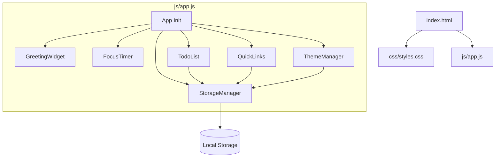

# Design Document: Personal Dashboard

## Overview

A single-page personal dashboard built with vanilla HTML, CSS, and JavaScript. All state is persisted to browser Local Storage; there is no backend. The app is delivered as a single `index.html` file that loads one CSS file (`css/styles.css`) and one JavaScript file (`js/app.js`).

The four core widgets — Greeting, Focus Timer, To-Do List, and Quick Links — are rendered inside a CSS Grid layout that reflows to a single column on narrow viewports. A theme toggle in the header switches between light and dark color schemes, with the OS preference used as the default when no saved preference exists.

### Key Design Decisions

- **No framework**: Vanilla DOM APIs keep the dependency surface zero and the bundle size minimal.
- **Module pattern via IIFE / ES module sections inside one file**: All logic lives in `js/app.js`, organized into clearly separated sections (StorageManager, GreetingWidget, FocusTimer, TodoList, QuickLinks, ThemeManager, App init).
- **CSS custom properties for theming**: A single `data-theme` attribute on `<html>` drives all color changes through CSS variables, making theme switching a one-line DOM operation.
- **Local Storage as the only persistence layer**: Keeps the app fully offline-capable and removes any server dependency.

---

## Architecture



### Data Flow

1. On page load, `App.init()` calls each module's `init()` method in order.
2. `StorageManager` provides `get(key)` / `set(key, value)` wrappers around `localStorage`.
3. Widgets read their initial state from `StorageManager` during `init()`.
4. User interactions mutate in-memory state, re-render the relevant widget, then call `StorageManager.set()` to persist.
5. `GreetingWidget` uses `setInterval` (60 s) to refresh the time display.
6. `FocusTimer` uses `setInterval` (1 s) while running.

---

## Components and Interfaces

### StorageManager

Responsible for all Local Storage I/O. Isolates parse errors so the rest of the app never crashes on corrupt storage.

```
StorageManager.get(key: string): any          // returns parsed value or null
StorageManager.set(key: string, value: any): void  // JSON-serialises and writes
StorageManager.KEYS: { TASKS, LINKS, THEME, SORT_ORDER }  // constant key names
```

### GreetingWidget

Reads the system clock and updates the DOM every minute.

```
GreetingWidget.init(): void   // renders immediately, starts interval
GreetingWidget.render(): void // updates time, date, greeting text
GreetingWidget.getGreeting(hour: number): string  // pure function: hour → greeting string
GreetingWidget.formatDate(date: Date): string     // pure function: Date → "Weekday, Month D"
```

### FocusTimer

Manages a 25-minute countdown with start / stop / reset controls.

```
FocusTimer.init(): void
FocusTimer.start(): void
FocusTimer.stop(): void
FocusTimer.reset(): void
FocusTimer.tick(): void          // called by interval; decrements seconds, checks 00:00
FocusTimer.render(): void        // updates MM:SS display and button states
FocusTimer.formatTime(seconds: number): string  // pure: total seconds → "MM:SS"
```

Internal state (not persisted):
```
{ totalSeconds: number, intervalId: number | null, running: boolean }
```

### TodoList

Manages an array of Task objects in memory, syncs to Local Storage on every mutation.

```
TodoList.init(): void
TodoList.add(text: string): boolean          // false if empty/duplicate
TodoList.edit(id: string, text: string): boolean
TodoList.toggle(id: string): void            // complete ↔ incomplete
TodoList.delete(id: string): void
TodoList.setSortOrder(order: 'created' | 'alpha'): void
TodoList.render(): void
TodoList.isDuplicate(text: string): boolean  // case-insensitive check
TodoList.persist(): void                     // calls StorageManager.set(TASKS, tasks)
```

### QuickLinks

Manages an array of Link objects, syncs to Local Storage on every mutation.

```
QuickLinks.init(): void
QuickLinks.add(label: string, url: string): boolean  // false if invalid
QuickLinks.delete(id: string): void
QuickLinks.isValidUrl(url: string): boolean          // pure URL validation
QuickLinks.render(): void
QuickLinks.persist(): void
```

### ThemeManager

Applies a `data-theme` attribute to `<html>` and persists the choice.

```
ThemeManager.init(): void          // reads storage or OS preference
ThemeManager.toggle(): void        // flips between 'light' and 'dark'
ThemeManager.apply(theme: string): void  // sets data-theme attribute
ThemeManager.detect(): string      // reads prefers-color-scheme media query
```

---

## Data Models

### Task

```json
{
  "id": "string (UUID or timestamp-based)",
  "text": "string",
  "completed": "boolean",
  "createdAt": "number (Unix ms timestamp)"
}
```

### Link

```json
{
  "id": "string",
  "label": "string",
  "url": "string (valid URL)"
}
```

### Local Storage Keys

| Key | Value type | Description |
|-----|-----------|-------------|
| `pd_tasks` | `Task[]` | All to-do tasks |
| `pd_links` | `Link[]` | All quick links |
| `pd_theme` | `"light" \| "dark"` | Active theme |
| `pd_sort_order` | `"created" \| "alpha"` | Current sort order |

### Sort Order Logic

- `"created"`: tasks ordered by `createdAt` ascending (oldest first)
- `"alpha"`: tasks ordered by `text` ascending, case-insensitive

Sorting is applied at render time only; the underlying array is always stored in insertion order.

---

## Correctness Properties

*A property is a characteristic or behavior that should hold true across all valid executions of a system — essentially, a formal statement about what the system should do. Properties serve as the bridge between human-readable specifications and machine-verifiable correctness guarantees.*


### Property 1: Greeting function covers all hours

*For any* hour value in [0, 23], `getGreeting(hour)` SHALL return exactly one of "Good morning", "Good afternoon", "Good evening", or "Good night", and the returned greeting SHALL correspond to the correct time range for that hour (morning: 5–11, afternoon: 12–17, evening: 18–21, night: 22–4).

**Validates: Requirements 1.3, 1.4, 1.5, 1.6**

---

### Property 2: Time formatting is always zero-padded MM:SS

*For any* integer number of seconds in [0, 1500], `formatTime(seconds)` SHALL return a string matching the pattern `MM:SS` where both MM and SS are zero-padded to two digits.

**Validates: Requirements 2.6**

---

### Property 3: Timer reset always returns to initial state

*For any* timer state (any remaining seconds in [0, 1500], any running state), calling `reset()` SHALL always produce `totalSeconds = 1500` and `running = false`.

**Validates: Requirements 2.4**

---

### Property 4: Adding a valid task grows the list

*For any* task list and any non-empty, non-duplicate task text, calling `add(text)` SHALL return `true`, increase the list length by exactly 1, and the new task SHALL have `completed = false` and `text` equal to the submitted text.

**Validates: Requirements 3.1**

---

### Property 5: Whitespace-only and duplicate inputs are rejected

*For any* string composed entirely of whitespace characters (including the empty string), `add(text)` SHALL return `false` and the task list SHALL remain unchanged. *For any* existing task text, submitting the same text in any casing variation SHALL also be rejected.

**Validates: Requirements 3.2, 3.3**

---

### Property 6: Toggle completion is a round-trip

*For any* task with any `completed` state, calling `toggle(id)` twice SHALL return the task to its original `completed` state.

**Validates: Requirements 3.5, 3.6**

---

### Property 7: Delete removes the task by id

*For any* task list containing at least one task, calling `delete(id)` for a task in the list SHALL result in no task with that `id` being present in the list, and all other tasks SHALL remain unchanged.

**Validates: Requirements 3.7**

---

### Property 8: Sort order does not mutate stored task data

*For any* task list, calling `setSortOrder('alpha')` or `setSortOrder('created')` SHALL NOT change the order or content of the array returned by `StorageManager.get(TASKS)` — only the rendered display order changes.

**Validates: Requirements 3.8**

---

### Property 9: Task list persistence round-trip

*For any* array of valid Task objects, writing them via `StorageManager.set(TASKS, tasks)` and then reading back via `StorageManager.get(TASKS)` SHALL return an array that is deeply equal to the original. After `TodoList.init()`, the in-memory task list SHALL match what was stored.

**Validates: Requirements 3.9, 3.10, 3.11, 5.1**

---

### Property 10: Adding a valid link grows the links list

*For any* links list and any non-empty label with a valid URL, calling `QuickLinks.add(label, url)` SHALL return `true` and increase the list length by exactly 1.

**Validates: Requirements 4.1**

---

### Property 11: Invalid link inputs are rejected

*For any* empty label or malformed URL string, `QuickLinks.add(label, url)` SHALL return `false` and the links list SHALL remain unchanged.

**Validates: Requirements 4.2**

---

### Property 12: Link list persistence round-trip

*For any* array of valid Link objects, writing them via `StorageManager.set(LINKS, links)` and then reading back via `StorageManager.get(LINKS)` SHALL return an array deeply equal to the original. After `QuickLinks.init()`, the in-memory links list SHALL match what was stored.

**Validates: Requirements 4.5, 4.6, 5.2**

---

### Property 13: Theme toggle is a round-trip

*For any* active theme ("light" or "dark"), calling `ThemeManager.toggle()` twice SHALL return the `data-theme` attribute on `<html>` to its original value, and `StorageManager.get(THEME)` SHALL equal the original theme.

**Validates: Requirements 7.1, 7.4**

---

### Property 14: Theme persistence round-trip

*For any* valid theme value ("light" or "dark"), saving it via `StorageManager.set(THEME, theme)` and then calling `ThemeManager.init()` SHALL result in `data-theme` on `<html>` being set to that saved theme value.

**Validates: Requirements 7.5**

---

## Error Handling

### StorageManager

- `get(key)`: wraps `localStorage.getItem` + `JSON.parse` in a try/catch. Returns `null` on any error (missing key, quota exceeded, parse failure, security error).
- `set(key, value)`: wraps `localStorage.setItem` + `JSON.stringify` in a try/catch. Silently swallows errors (quota exceeded, private browsing restrictions) so the UI remains functional.
- On `null` return from `get`, each widget falls back to its empty/default state.

### Input Validation

- **TodoList.add**: trims whitespace, rejects empty string, performs case-insensitive duplicate check before mutating state.
- **QuickLinks.add**: rejects empty label; validates URL using `new URL(url)` constructor (throws on invalid input) and checks that the protocol is `http:` or `https:`.
- **FocusTimer**: no user text input; controls are disabled/enabled via DOM state to prevent invalid interactions (e.g., start while already running).

### Timer Edge Cases

- `tick()` checks `totalSeconds <= 0` before decrementing to prevent negative values.
- `reset()` calls `clearInterval` before resetting state to prevent orphaned intervals.

---

## Testing Strategy

### Approach

This feature is well-suited for property-based testing because it contains multiple pure functions (greeting logic, time formatting, URL validation, sort logic) and stateful modules with clear invariants (task list, links list, theme toggle). The chosen PBT library is **fast-check** (JavaScript), which runs in Node.js and integrates with Jest or Vitest.

### Unit Tests (Example-Based)

Focus on specific scenarios and integration points:

- `FocusTimer`: initial state is 25:00, stop preserves current time, timer stops at 00:00.
- `ThemeManager.detect()`: returns correct theme when `prefers-color-scheme` is mocked.
- `QuickLinks`: rendered link buttons have `target="_blank"` and correct `href`.
- `StorageManager`: corrupt JSON in localStorage returns `null` without throwing.
- DOM smoke tests: all four widget containers exist on page load.

### Property-Based Tests (fast-check, minimum 100 iterations each)

Each test is tagged with its design property for traceability.

| Test | Property | Tag |
|------|----------|-----|
| `getGreeting` covers all hours | Property 1 | `Feature: personal-dashboard, Property 1` |
| `formatTime` always produces MM:SS | Property 2 | `Feature: personal-dashboard, Property 2` |
| `reset()` always returns to 25:00 | Property 3 | `Feature: personal-dashboard, Property 3` |
| Adding valid task grows list | Property 4 | `Feature: personal-dashboard, Property 4` |
| Whitespace/duplicate inputs rejected | Property 5 | `Feature: personal-dashboard, Property 5` |
| Toggle completion round-trip | Property 6 | `Feature: personal-dashboard, Property 6` |
| Delete removes task by id | Property 7 | `Feature: personal-dashboard, Property 7` |
| Sort order does not mutate storage | Property 8 | `Feature: personal-dashboard, Property 8` |
| Task list persistence round-trip | Property 9 | `Feature: personal-dashboard, Property 9` |
| Adding valid link grows list | Property 10 | `Feature: personal-dashboard, Property 10` |
| Invalid link inputs rejected | Property 11 | `Feature: personal-dashboard, Property 11` |
| Link list persistence round-trip | Property 12 | `Feature: personal-dashboard, Property 12` |
| Theme toggle round-trip | Property 13 | `Feature: personal-dashboard, Property 13` |
| Theme persistence round-trip | Property 14 | `Feature: personal-dashboard, Property 14` |

### Test Configuration

```js
// fast-check configuration
fc.configureGlobal({ numRuns: 100 });
```

Each property test uses `fc.assert(fc.property(...))` with appropriate arbitraries (e.g., `fc.integer({ min: 0, max: 23 })` for hours, `fc.string()` for task text, `fc.array(taskArbitrary)` for task lists).

`localStorage` is mocked in tests using a simple in-memory Map to avoid browser dependency and keep tests fast.
